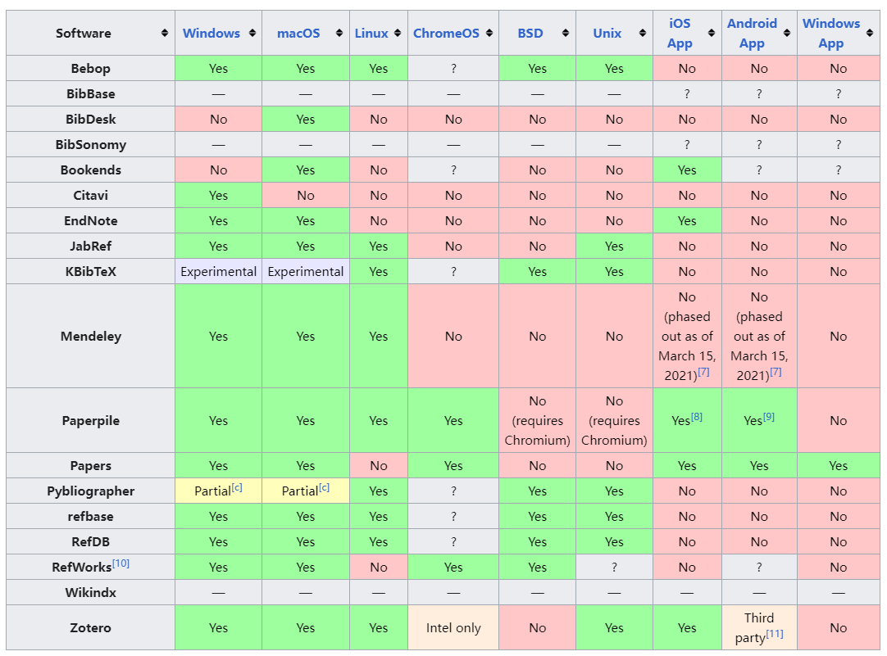
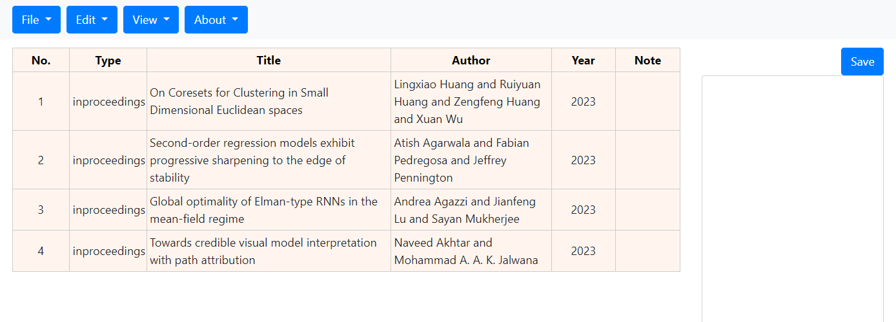

## BibTex Manager (btm)

In 2024, I am a PhD student. Every day I search for, read, and record literature. Managing literature has been a core task. To accomplish it efficiently, I have used popular reference management software, including but not limited to JabRef, Mendeley, and Zotero. However, the sizes of these tools are too large. For example, the size of [JabRef](https://jabref.org/) is 196MB (v5.15), the size of [Mendeley](https://www.mendeley.com/) is 172MB (v2.120.0), and the size of [Zotero](https://www.zotero.org/) is 49.2MB (v6.0.36). I can't understand why managing a simple text file (dot bib) requires so many resources.

In this project, I implemented a bibtex manager that was only 10kb in size. It includes the following features:
1. bib file import.
2. bib file parsing.
3. Note function and saving (work in process).

More features are coming...